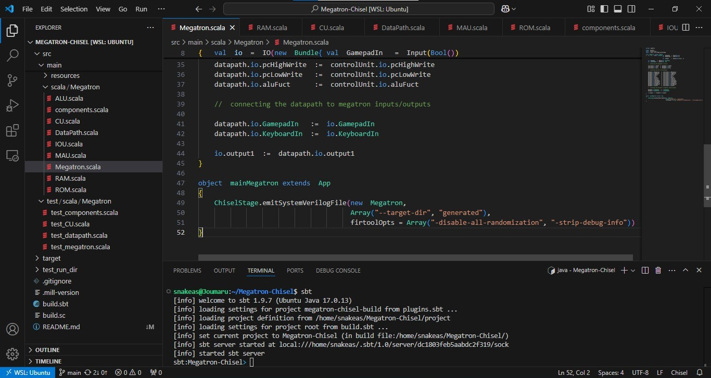

# Megatron-Chisel Project
================================

The project Megatron-chisel is an implementation of [Megatron project](https://www.el-kalam.com/projets/projet-megatron/) 
 of the hardware description language [Chisel](https://www.chisel-lang.org/). 
Chisel generate at the end System Verilog files (possible to generate Verilog also), 
that can be used in hardware simulation or a bitstream loaded to an FPGA with some additional specific configurations.

## How to test Megatron-Chisel

The first way to test Megatron-Chisel is to use the official Chisel tester tool called [Chiseltest](https://github.com/ucb-bar/chiseltest), 
it is a library used to perform formal verification for hardware circuits.

The second way, it is also a very effectif way, by inspecting the simulation signal waveformes using [GTKWave](https://gtkwave.sourceforge.net/).

But the ultimate way to test Megatron-Chisel is evidently by writing some programs or pieces of code and running the clock to inspect the results after execution. 
You have already two preprogrammed algorithms, fibonacci and factorial. Written in binary or machine language, 
after translation from assembly language (done previously on [Megatron project](https://www.el-kalam.com/projets/projet-megatron/)). 
The programs are saved in hexadecimal format in .ROM text files, and loaded in the ROM while starting the machine.

## Installing Chisel laguage on windows and using VS Code

In my personal experience, chisel wasn't fully compatible with windows. In my opinion, 
it is better to make it work on Linux emulated under Windows, and this is what we are going to explain in this section.

There are many ways to emulate Linux under Windows, like using [virtual machines](https://en.wikipedia.org/wiki/Virtual_machine), 
using libraries and toolboxes that provide Unix-like environement, like [MSYS](https://www.msys2.org/) and [MinGW](https://www.mingw-w64.org/). 
Or in our case using [WSL](https://en.wikipedia.org/wiki/Windows_Subsystem_for_Linux), Windows Subsystem for Linux, 
provided by Windows to run a Linux environement on Windows.

### 1. Installing WSL

This step is about installing Linux environment while will host Chisel language. It could be installed as follows :
- Launch the Windows command-line by typing CMD in the research textbox of the windows taskbar (it is also possible to use PowerShell instead if it is installed). Then type the command :
```sh
wsl --install
```
- Proceed the following steps of the installation.
- At a certain point it is required to create a Linux user account and its corresponding password. Mandatory later to use Linux commands.
- It is also possible to get help following this [WSL installation tutorial](https://learn.microsoft.com/en-us/windows/wsl/install).

### 2. Installing Scala and Chisel tools and dependencies

Chisel is based on [Scala](https://www.scala-lang.org/) as a [domain-specific language](https://en.wikipedia.org/wiki/Domain-specific_language) (DSL). 
It means that Chisel is a language created upon Scala language and inherit its properties and principles. 
The following steps allow the installation of the tools and dependencies needed for Scala/Chisel to compile under Linux.

1. Launch of WSL from Windows programs, and preparing the linux installation tool using the command (password required) :
```sh
sudo apt-get update
```

2. installing Java Runtime Environment :
```sh
sudo apt-get install default-jre
```

3. installing Scala Building Tool SBT (it is possible to look for a newer versions):
```sh
curl -s -L https://github.com/sbt/sbt/releases/download/v1.9.7/sbt-1.9.7.tgz | tar xvz
sudo mv sbt/bin/sbt /usr/local/bin/
```

4. installing the signal wave viewer GTKwave :
```sh
sudo apt-get install gtkwave
```

5. installing Verilator, the Chisel hardware simulator. But first we need the necessary tools to build it :
```sh
sudo apt-get install git help2man perl python3 make autoconf g++ flex bison ccache
sudo apt-get install libgoogle-perftools-dev numactl perl-doc
sudo apt-get install libfl2
sudo apt-get install libfl-dev
sudo apt-get install zlib1g zlib1g-dev
```
After installing the building tools, the next sequence of commands is to download its source code and build it
```sh
git clone https://github.com/verilator/verilator 

unset VERILATOR_ROOT
cd verilator

git pull
git checkout v5.024

autoconf
./configure
make -j `nproc`
sudo make install
```
It is possible to look for more recent version that v5.024. 
It is also possible to check the following [guide](https://verilator.org/guide/latest/install.html#installation) for additional information.

6. From now on, it is possible to compile, run, and simulate digital circuit designed by Chisel using only command-line.

For instance, you downloaded the [Megatron-Chisel](https://github.com/kara-abdelaziz/Megatron-Chisel/archive/refs/heads/main.zip)
directory and you acceded to the directory containing the file **build.sbt**. It is now possible to launch scala builder SBT like this :
```sh
sbt
```
It is possible to compile all the project files with the command :
```sh
compile
```
Run, for example the source file **Megatron.scala** by the command :
```sh
runMain megatron.mainMegatron
```
Or perform a test written in the file **test_megatron.scala** by the command (**DUT_megatron** is a class defined in **test_megatron.scala** file) :
```sh
testOnly DUT_megatron
```
When finishing with SBT, it is possible to quit by :
```sh
exit
```
It is also possible to do a globe compile, run, and test of the entire project without entering SBT and do it file by file, with those 3 commands :
```sh
sbt compile
sbt run
sbt test
```
6. After a correct compile, run, and test you get a corresponding generated System Verilog (.sv) file inside the directory **generated**, that can be used in a simulator or an FPGA.
 
7. It is also possible to view a waveform model using GKTwave, created alongside the test process. For example, it is possible to view the waveform of the entire Megatron circuit using this command :
```sh
gtkwave -f test_run_dir/DUT_megatron_should_be_able_to_perform_a_Fibonacci_sequence/Megatron.vcd
```
The .vcd file containing the waveform was generated in the test process phase.

### 3. Installing VS Code

[VS Code](https://code.visualstudio.com/) was the IDE used to develop Megatron-Chisel in Chisel. Two additional extensions to VS cOde were installed, **Chisel syntax** and **WSL**. 
The first one implied to the syntax highlight, and the second to integrate the installed WSL command-line within VS Code. The sceen shot below gives an overview of the IDE configuration.




## Make your own Chisel3 project

### Dependencies

#### JDK 8 or newer

We recommend LTS releases Java 8 and Java 11. You can install the JDK as your operating system recommends, or use the prebuilt binaries from [AdoptOpenJDK](https://adoptopenjdk.net/).

#### SBT or mill

SBT is the most common build tool in the Scala community. You can download it [here](https://www.scala-sbt.org/download.html).  
mill is another Scala/Java build tool without obscure DSL like SBT. You can download it [here](https://github.com/com-lihaoyi/mill/releases)

#### Verilator

The test with `svsim` needs Verilator installed.
See Verilator installation instructions [here](https://verilator.org/guide/latest/install.html).

### How to get started

#### Create a repository from the template

This repository is a Github template. You can create your own repository from it by clicking the green `Use this template` in the top right.
Please leave `Include all branches` **unchecked**; checking it will pollute the history of your new repository.
For more information, see ["Creating a repository from a template"](https://docs.github.com/en/free-pro-team@latest/github/creating-cloning-and-archiving-repositories/creating-a-repository-from-a-template).

#### Wait for the template cleanup workflow to complete

After using the template to create your own blank project, please wait a minute or two for the `Template cleanup` workflow to run which will removes some template-specific stuff from the repository (like the LICENSE).
Refresh the repository page in your browser until you see a 2nd commit by `actions-user` titled `Template cleanup`.


#### Clone your repository

Once you have created a repository from this template and the `Template cleanup` workflow has completed, you can click the green button to get a link for cloning your repository.
Note that it is easiest to push to a repository if you set up SSH with Github, please see the [related documentation](https://docs.github.com/en/free-pro-team@latest/github/authenticating-to-github/connecting-to-github-with-ssh). SSH is required for pushing to a Github repository when using two-factor authentication.

```sh
git clone git@github.com:kara-abdelaziz/Megatron-Chisel.git
cd Megatron-Chisel
```

#### Set project organization and name in build.sbt

The cleanup workflow will have attempted to provide sensible defaults for `ThisBuild / organization` and `name` in the `build.sbt`.
Feel free to use your text editor of choice to change them as you see fit.

#### Clean up the README.md file

Again, use you editor of choice to make the README specific to your project.

#### Add a LICENSE file

It is important to have a LICENSE for open source (or closed source) code.
This template repository has the Unlicense in order to allow users to add any license they want to derivative code.
The Unlicense is stripped when creating a repository from this template so that users do not accidentally unlicense their own work.

For more information about a license, check out the [Github Docs](https://docs.github.com/en/free-pro-team@latest/github/building-a-strong-community/adding-a-license-to-a-repository).

#### Commit your changes
```sh
git commit -m 'Starting Megatron-Chisel'
git push origin main
```

### Did it work?

You should now have a working Chisel3 project.

You can run the included test with:
```sh
sbt test
```

Alternatively, if you use Mill:
```sh
mill Megatron-Chisel.test
```

You should see a whole bunch of output that ends with something like the following lines
```
[info] Tests: succeeded 1, failed 0, canceled 0, ignored 0, pending 0
[info] All tests passed.
[success] Total time: 5 s, completed Dec 16, 2020 12:18:44 PM
```
If you see the above then...

### It worked!

You are ready to go. We have a few recommended practices and things to do.

* Use packages and following conventions for [structure](https://www.scala-sbt.org/1.x/docs/Directories.html) and [naming](http://docs.scala-lang.org/style/naming-conventions.html)
* Package names should be clearly reflected in the testing hierarchy
* Build tests for all your work
* Read more about testing in SBT in the [SBT docs](https://www.scala-sbt.org/1.x/docs/Testing.html)
* This template includes a [test dependency](https://www.scala-sbt.org/1.x/docs/Library-Dependencies.html#Per-configuration+dependencies) on [ScalaTest](https://www.scalatest.org/). This, coupled with `svsim` (included with Chisel) and `verilator`, are a starting point for testing Chisel generators.
  * You can remove this dependency in the build.sbt file if you want to
* Change the name of your project in the build.sbt file
* Change your README.md

## Problems? Questions?

Check out the [Chisel Users Community](https://www.chisel-lang.org/community.html) page for links to get in contact!
